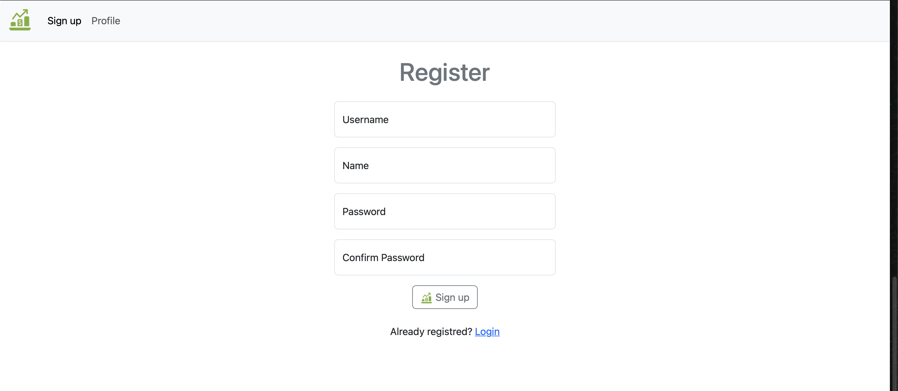
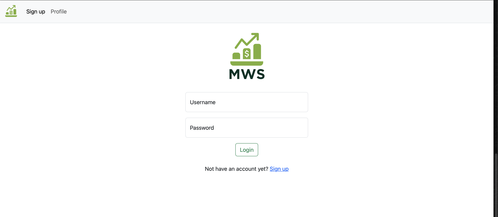
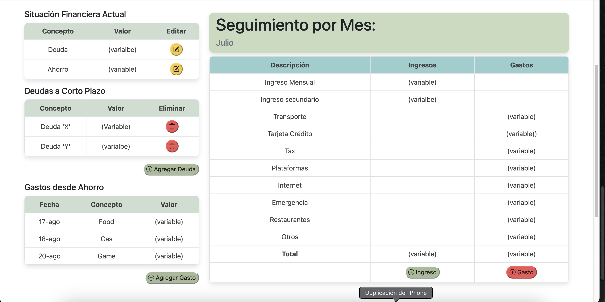

# Flask Financial Health App

Esta es una aplicación web orientada a la salud financiera, desarrollada con Flask. Permite a los usuarios registrar ingresos y gastos, y visualizar su estado financiero actual.

## Características

- **Registro de Usuario**: Los nuevos usuarios pueden crear una cuenta proporcionando un nombre de usuario, nombre completo y contraseña.
- **Inicio de Sesión**: Los usuarios registrados pueden iniciar sesión con su nombre de usuario y contraseña.
- **Gestión de Ingresos y Gastos**: Una vez autenticados, los usuarios pueden añadir, editar y eliminar ingresos y gastos.
- **Visualización del Estado Financiero**: La aplicación muestra el balance actual basado en los ingresos y gastos registrados.

## Acceso a la Aplicación

Puedes probar la aplicación en el siguiente enlace:

🔗 [Flask Financial Health App](https://flask-app-rc8n.onrender.com)

## Uso

### Registro de Usuario

Los nuevos usuarios pueden registrarse proporcionando la siguiente información:

- **Nombre de Usuario**: Nombre único para el usuario.
- **Nombre Completo**: Nombre real del usuario.
- **Contraseña**: Clave de acceso segura.

### Inicio de Sesión

Los usuarios registrados pueden iniciar sesión ingresando su nombre de usuario y contraseña.

### Panel de Usuario

Después de iniciar sesión, los usuarios pueden ver su panel personal, donde se muestra su balance financiero actual y opciones para gestionar ingresos y gastos.

## Usuario de Prueba

Para propósitos de prueba, puedes utilizar las siguientes credenciales:

- **Nombre de Usuario**: `Alejo`
- **Contraseña**: `alejo`

## Contribuciones

Las contribuciones son bienvenidas. Por favor, sigue estos pasos para contribuir:

1. Haz un fork del repositorio.
2. Crea una nueva rama (`git checkout -b feature/nueva-funcionalidad`).
3. Realiza tus cambios y haz commit (`git commit -m 'Añadir nueva funcionalidad'`).
4. Sube tus cambios (`git push origin feature/nueva-funcionalidad`).
5. Abre un Pull Request.

## Licencia

Este proyecto está bajo la Licencia MIT. Consulta el archivo `LICENSE` para más detalles.

